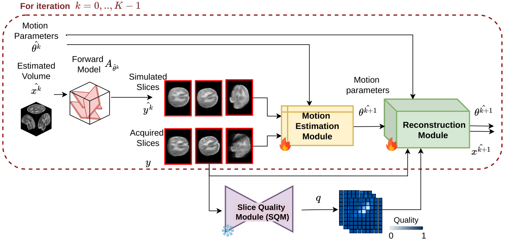

# PRISM

**Learning Priors for Robust Slice-to-Volume Registration in Ill-Posed Fetal MRI**

Vladyslav Zalevskyi, Thomas Sanchez, Meritxell Bach Cuadra
*Department of Radiology, Lausanne University Hospital and University of Lausanne (UNIL) · CIBM Center for Biomedical Imaging, Lausanne, Switzerland*

---

Slice-to-volume registration (SVR) recovers the pose of every 2D slice of a
motion-corrupted fetal MRI acquisition, and is the step that decides whether a
super-resolution reconstruction (SRR) succeeds. Iterative SVR methods register
slices against an *intermediate reconstruction* — but that reconstruction is
usually driven by data consistency alone, so it degrades exactly when the
measurements are sparse, corrupted or misaligned, and drags the motion estimates
down with it.

**PRISM** breaks that feedback loop by putting a *learned anatomical prior*
inside the SVR loop. One forward pass alternates

<!-- add overview figure below -->
<div align="center">

</div>


1. **motion estimation** — a transformer (SVoRT backbone) predicts a pose update
   from the acquired slices and the current volume estimate;
2. **prior-regularized reconstruction** — a data-consistency CG solve, a residual
   3D denoiser (the learned prior), then a second CG solve that pulls the volume
   toward the prior *only where the measurements are unreliable* (a MoDL step);
3. **spatially adaptive weighting** — a dense per-pixel slice-quality module
   (SQM) times a training-free NCC registration-consistency gate decides, per
   pixel and per slice, how much the data is trusted versus the prior.

On 486 simulated test cases spanning three levels of ill-posedness, PRISM lowers
the anchor-point error by **~24 %** relative to the SVoRT backbone, and it
improves slice-level reconstruction consistency on 170 clinical fetal scans.

<div align="center">

| Simulated split | SVoRT | SVoRT (+Q) | SVoRT (+R) | **PRISM** |
|---|---|---|---|---|
| Good — point error (mm) ↓ | 5.62 | 5.37 | 5.08 | **4.25** |
| Med — point error (mm) ↓ | 5.96 | 5.63 | 5.28 | **4.47** |
| Bad — point error (mm) ↓ | 6.34 | 6.06 | 5.46 | **4.90** |

</div>

---

## Contents

- [Installation](#installation)
- [Pretrained weights](#pretrained-weights)
- [Quick start: run PRISM on a BIDS folder](#quick-start-run-prism-on-a-bids-folder)
- [Preparing your data](#preparing-your-data)
- [Reproducing the paper](#reproducing-the-paper)
- [Training from scratch](#training-from-scratch)
- [Repository layout](#repository-layout)
- [Notes and limitations](#notes-and-limitations)
- [Citation](#citation)

---

## Installation

**A CUDA GPU is required.** The forward model — slice acquisition
`A_θ` and its adjoint `Aᵗ` — is a CUDA extension (inherited from
[SVoRT](https://github.com/daviddmc/SVoRT)); there is no CPU fallback.
`pip install -e .` compiles it, which needs `nvcc` (CUDA toolkit) and a C++
compiler. Reference environment: Python 3.10, PyTorch 2.3.0 + CUDA 11.8,
NVIDIA RTX 6000 Ada.

<details open>
<summary><b>pip</b></summary>

```bash
git clone https://github.com/Medical-Image-Analysis-Laboratory/prism.git
cd prism

# PyTorch first, so the extensions compile against the right CUDA build
pip install torch==2.3.0 torchvision==0.18.0 \
    --index-url https://download.pytorch.org/whl/cu118
pip install -r requirements.txt
pip install -e .            # builds slice_acq_cuda + transform_convert_cuda
```
</details>

<details>
<summary><b>conda</b> (installs its own CUDA toolkit — only a driver needed on the host)</summary>

```bash
conda env create -f environment.yml
conda activate prism
pip install -e .
```
</details>

<details>
<summary><b>Docker</b></summary>

```bash
docker build -t prism .     # ~15 min, ~15 GB: CUDA devel base + PyTorch + extensions

docker run --gpus all --rm \
    -v /data/mybids:/data:ro -v /weights:/weights:ro -v /output:/out \
    prism scripts/predict_bids.py -i /data -o /out -w /weights/prism_weights.pth
```

Set `TORCH_CUDA_ARCH_LIST` in the `Dockerfile` to just your GPU's architecture
(e.g. `8.9` for RTX 40xx / L40) to cut the build time.
</details>

Verify the install:

```bash
python -c "import torch, slice_acq_cuda, transform_convert_cuda; print('ok')"
```

If the extensions are missing at run time, they are JIT-compiled on first use
(cached in `$SYNTHGEN_EXT_CACHE`, default `~/.cache/synthgen/cuda_ext`), so a
plain `pip install -r requirements.txt` also works as long as `nvcc` is on the
`PATH`.

---

## Pretrained weights

The trained **PRISM** model (86.6 M parameters, 347 MB) is released as a plain
`state_dict`:

> **Download:** [`prism_weights.pth` on Google
> Drive](https://drive.google.com/file/d/GOOGLE_DRIVE_FILE_ID/view?usp=sharing)
>
> Replace `GOOGLE_DRIVE_FILE_ID` with the id of the uploaded file.

```bash
pip install gdown
gdown --id GOOGLE_DRIVE_FILE_ID -O weights/prism_weights.pth
```

Only PRISM itself is released; the three ablation variants (`SVoRT`,
`SVoRT (+Q)`, `SVoRT (+R)`) can be retrained with the configs in
[`configs/experiment/prism/`](configs/experiment/prism/).

The file is loadable with `torch.load(..., weights_only=True)` anywhere — no
part of the training environment is baked in. It was produced from a Lightning
training checkpoint with

```bash
python scripts/export_release_checkpoint.py <training>.ckpt weights/prism_weights.pth
```

`scripts/predict_bids.py` accepts either form.

---

## Quick start: run PRISM on a BIDS folder

```bash
python scripts/predict_bids.py \
    --bids-dir   /data/mybids/derivatives/masked \
    --output-dir /data/mybids/derivatives/prism \
    --weights    weights/prism_weights.pth
```

Input: one BIDS folder of **brain-masked** 2D stacks; every stack of a
subject/session is registered jointly.

```
<bids-dir>/sub-001/ses-01/anat/sub-001_ses-01_acq-haste_run-1_T2w.nii.gz
                                sub-001_ses-01_acq-haste_run-2_T2w.nii.gz
                                ...
```

Sessions are optional (`sub-001/anat/...` works too), and `--img-suffix` selects
the suffix to read (default `T2w`). Output, per subject/session:

| file | contents |
|---|---|
| `*_type-SRRest_T2w.nii.gz` | reconstruction at the estimated poses, 1 mm isotropic |
| `*_motion-pred.npz` / `.csv` | per-slice rigid poses: matrices, 6-DOF, anchor points |
| `*_slice_metrics.csv` | per-slice agreement between acquired and re-projected slices |
| `metrics.csv` (root) | one row per subject/session, averaged over its slices |
| `*_type-{GT,EST}slices_T2w.nii.gz` | with `--save-slices`: the acquired and re-projected slices |

Runtime is ~2 s per subject on an RTX 6000 Ada. Useful flags:

```
--subjects sub-001 sub-002   only these subjects
--variant {prism,svort,svort_q,svort_r}   architecture matching the weights
--n-iter 4 --cg-iter 4       registration and CG iterations (defaults reproduce the paper)
--recon {dc,regularized}     which reconstruction to save and score (see below)
--keep-empty-slices          feed near-empty slices to the model as well
--volume-shape 128 128 128   reconstruction grid
```

**`--recon`** — `dc` (the default, and what the paper reports) saves the plain
data-consistency solve at the final poses; `regularized` saves the
prior-regularized volume the SVR loop refines the poses against. PRISM's
contribution is the *motion estimate*, so reconstructions are compared without
the prior, which would otherwise be rewarded for inpainting.

To use the model directly:

```python
from synthgen.models.prism import build_prism

model = build_prism(variant="prism", weights="weights/prism_weights.pth")
out = model.predict_step(batch, 0)      # out["transforms_pred"][-1]: (N, 3, 4)
```

---

## Preparing your data

PRISM expects each slice to be brain-masked, in `[0, 1]`, on a 128-voxel
in-plane grid — the same preprocessing the model was trained and evaluated with.
For the clinical cohort of the paper this was the default
[FetPype](https://fetpype.github.io/fetpype/) pipeline (bias-field correction +
fetal brain extraction), followed by masking and normalisation. The scripts to
do it:

```bash
# 1. N4 bias-field correction, in place (skip if your pipeline already does it)
python scripts/make_bids_biascorrected.py /data/mybids

# 2. brain masks -- any fetal brain extraction tool; FetPype's masks work as is.
#    To derive masks from already-masked images, threshold them:
python scripts/make_bids_masks.py /data/mybids/derivatives/masked \
                                  /data/mybids/derivatives/masks

# 3. mask x image, clip to the 1-99 percentile, rescale to [0,1],
#    crop/pad to 128^3 around the brain
python scripts/apply_brain_mask.py \
    -i /data/mybids -m /data/mybids/derivatives/masks \
    -o /data/mybids/derivatives/masked
```

Step 3 writes `..._T2w_maskout.nii.gz`, so pass
`--img-suffix T2w_maskout` to `predict_bids.py`.

Thick-slice stacks end up with most of their 128 slices empty after the padding;
`predict_bids.py` drops near-empty slices (≤ 100 brain voxels) from the model
input by default, as in the paper's evaluation.

High-resolution reference volumes used to *simulate* stacks additionally need to
be on a common isotropic grid:

```bash
python scripts/resample_crop_pad.py --bids-path /data/reference_volumes \
    --res 1.0 --target-size 256 256 256 --image-patterns T2w --label-patterns dseg
```

---

## Reproducing the paper

Nothing here is hard-wired to a machine: dataset roots come from environment
variables (see [`configs/paths/default.yaml`](configs/paths/default.yaml)) and
can be overridden on the command line.

| variable | contents |
|---|---|
| `PRISM_TRAIN_DATA` | BIDS folder of reference SRR volumes + `participants.csv` |
| `PRISM_SIM_TEST_DATA` | root of the simulated test sets: `{Good,Med,Bad}/` |
| `PRISM_REAL_DATA` | a real (clinical) BIDS dataset of acquired stacks |
| `PRISM_PREDICTIONS` | where inference writes its output |
| `PRISM_INIT_CKPT` | the assembled initialisation checkpoint (training only) |
| `MEDICALNET_WEIGHTS` | MedicalNet ResNet-10 weights for the perceptual loss (training only) |

`participants.csv` sits at the root of the folder it belongs to and is a
two-column CSV, `participant_id,splits`, whose `splits` values are `train` /
`val` / `test` (see [`data/participants.csv`](data/participants.csv)). The
config-driven evaluation selects subjects through it, including for
`PRISM_REAL_DATA`; `scripts/predict_bids.py` needs no CSV and simply takes every
`sub-*` it finds.

**1 — simulate the three test sets.** Each level draws fewer stacks and stronger
artefacts (Table 1 of the paper: `Good` 6–12 stacks and no artefacts, `Med` 3–6,
`Bad` 1–3 with `p_void = p_missing = 0.3`):

```bash
export PRISM_TRAIN_DATA=/data/reference_volumes
export PRISM_SIM_TEST_DATA=/data/simulated_test

for level in good med bad; do
  python -m synthgen.generate_stack_database experiment=datagen/simreal$level
done
```

Each subject gets simulated stacks, the ground-truth poses (`*_motion.npz`), the
reference volume and the dense per-pixel quality labels.

**2 — run the models.** `scripts/evalall.sh` evaluates one checkpoint on the
three simulated sets and on the real cohort:

```bash
./scripts/evalall.sh /path/to/1svort_sqm_reg3/runs/<date>/checkpoints/<file>.ckpt
```

**3 — build the tables.** [`analysis/`](analysis/) turns the predictions into the
tables of the paper (point error, slice metrics, and volume metrics after rigid
registration to the reference):

```bash
python analysis/build_metrics.py                  # -> analysis/results/*.csv
python analysis/make_table.py                     # -> results/comparison_table.tex
python analysis/make_table_chuv.py                # -> results/chuv_table.tex
python analysis/stat_tests.py                     # paired Wilcoxon, Holm-corrected
```

The committed `analysis/results/*.tex` are the tables of the paper; the per-scan
CSVs are regenerated locally (they carry the subject ids of the source datasets
and are not redistributed).

The clinical cohort (170 CHUV examinations) cannot be shared. The public
datasets used for the simulated splits are listed in the supplementary material
of the paper.

---

## Training from scratch

Each component is pre-trained on its own, the three are combined into one
initialisation checkpoint, and every model is then fine-tuned end to end.

```bash
export PRISM_TRAIN_DATA=/data/reference_volumes
export MEDICALNET_WEIGHTS=/weights/resnet_10_23dataset.pth   # perceptual loss
```

**1 — pre-train the components**

```bash
python synthgen/train.py experiment=prism/0svort     # SVoRT backbone, retrained
python synthgen/train.py experiment=prism/0sqm       # slice-quality module, 1200 ep
python synthgen/train.py experiment=prism/0reg1ch    # one residual denoiser, 1500 ep
```

**2 — assemble the initialisation** (the denoiser is copied into all *K* = 3
per-iteration instances):

```bash
python scripts/assemble_init_checkpoint.py \
    --svort logs/0svort/runs/<date>/checkpoints/<file>.ckpt \
    --sqm   logs/0sqm/runs/<date>/checkpoints/<file>.ckpt \
    --reg   logs/0reg1ch/runs/<date>/checkpoints/<file>.ckpt \
    --n-denoisers 3 -o weights/prism_init.ckpt

export PRISM_INIT_CKPT=$PWD/weights/prism_init.ckpt
```

**3 — fine-tune end to end** (1000 epochs, lr 1e-5). The four configs are the
ablation of the paper:

| config | paper | SQM | learned prior | NCC gate |
|---|---|:--:|:--:|:--:|
| `prism/1svort_4cgit` | SVoRT (4 CG iterations) | – | – | – |
| `prism/1svort_sqm` | SVoRT (+Q) | ✔ | – | – |
| `prism/1svort_reg` | SVoRT (+R) | – | ✔ | – |
| `prism/1svort_sqm_reg3` | **PRISM** | ✔ | ✔ | ✔ |

```bash
python synthgen/train.py experiment=prism/1svort_sqm_reg3
```

Any config value can be overridden inline, e.g.
`trainer.max_epochs=100 logger=csv data.num_workers=4`. Training stacks are
simulated **on the fly** from the reference volumes (no offline dataset): the
scanner samples resolution, thickness, stack count and orientation per sample,
adds recorded fetal motion trajectories, and applies the artefact family of
Table 1 (signal voids, in-plane motion, local and whole-slice blur, missing
slices, bias fields, intensity scaling, noise) together with the paired
ground-truth quality maps.

---

## Repository layout

```
synthgen/
  models/
    prism.py            build_prism(): the model, without Hydra
    svort.py            SRRLightning: the SVR loop (Algorithm 1) + losses
    transformer.py      SVoRT motion-estimation transformer
    regularizers.py     DenoisingResUNet3D, the learned prior
    sbqm.py             QualityNet, the dense slice-quality module (SQM)
    reconstructionorig.py  weighted CG data-consistency solver (SRR)
  generator/            scanner simulation: stacks, motion, artefacts
    slice_acquisition/  CUDA forward model A_theta and its adjoint
    transform/          rigid-transform CUDA conversions
  data/                 BIDS datasets and the Lightning DataModule
  utils/checkpoint.py   portable checkpoint loading
  train.py              training entry point
  inference.py          config-driven evaluation entry point
  generate_stack_database.py   writes a simulated BIDS test set

scripts/
  predict_bids.py            >>> run PRISM on a BIDS folder <<<
  apply_brain_mask.py        mask + normalise + crop/pad acquired stacks
  make_bids_masks.py         threshold images into a mask dataset
  make_bids_biascorrected.py N4 bias-field correction over a BIDS folder
  resample_crop_pad.py       put reference volumes on a common isotropic grid
  assemble_init_checkpoint.py  combine the pre-trained components
  export_release_checkpoint.py training .ckpt -> portable weights
  evalall.sh                 evaluate one checkpoint on all four test sets
  run_nesvor_bids.sh         NeSVoR reconstructions (the SRR reference of Figs. 1, 3)

configs/                Hydra configs (experiment/prism/, inference*, paths/)
analysis/               per-scan metrics -> the LaTeX tables of the paper
data/                   three public reference volumes, as a runnable demo
```

Smoke tests that need no checkpoint (both need a GPU):

```bash
python -m synthgen.generator.scanner     # simulate stacks from data/, one scan
python -m synthgen.models.sbqm           # SQM forward pass
```

[`data/README.md`](data/README.md) walks through simulating a dataset from the
three demo volumes and registering it end to end.

---

## Notes and limitations

- **GPU only.** The forward model is a CUDA extension; `--device cpu` is not
  supported.
- **128 × 128 slices, 128³ reconstruction grid.** The released weights were
  trained at this size (`--slice-size`, `--volume-shape`); larger grids work but
  are outside the training distribution.
- **Rigid inter-slice motion only** — no intra-slice deformation, like the
  SVoRT backbone.
- **Training is fully supervised on simulated data,** so a simulation-to-reality
  gap remains; gains on clinical data are smaller than in simulation.
- **The learned prior can hallucinate.** In severely under-constrained regions
  the denoiser fills in anatomy from the training distribution. PRISM enforces
  data consistency rather than replacing measurements, and this is exactly why
  the *reported* reconstructions use the DC-only solve — but volumes from
  `--recon regularized` should be read with care, especially for abnormal
  anatomy.
- PRISM is an SVR component, not a complete SRR pipeline. Its poses can
  initialise a reconstruction method such as
  [NeSVoR](https://github.com/daviddmc/NeSVoR) or SVRTK.

## Citation

```bibtex
@inproceedings{zalevskyi2026prism,
  title     = {{PRISM}: Learning Priors for Robust Slice-to-Volume
               Registration in Ill-Posed Fetal {MRI}},
  author    = {Zalevskyi, Vladyslav and Sanchez, Thomas and Bach Cuadra, Meritxell},
  year      = {2026},
}
```

PRISM builds on **SVoRT** (Xu et al., MICCAI 2022) for the motion-estimation
transformer and the CUDA forward model, on **MoDL** (Aggarwal et al., 2019) for
the model-based prior, and on MONAI and PyTorch Lightning.

## License and acknowledgements

Released under the [GNU General Public License v2](LICENSE). This research was funded by the
Swiss National Science Foundation (215641), with the support of the CIBM Center
for Biomedical Imaging and grants from NVIDIA (RTX 6000 Ada GPUs).
